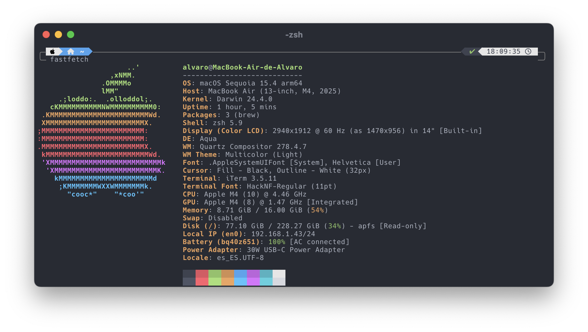

# Varoso's dotfiles



## Install

For an automatic install you can use the following command:

```zsh
sh -c "$(curl -fsSL https://raw.githubusercontent.com/Varoso/dotfiles/master/install.sh)" 
```

**NOTE:** You can use *wget* or *fetch* if you don't have *curl* installed.

## Font

Any of the [Nerd Fonts](https://github.com/ryanoasis/nerd-fonts) can be used for the best compatibility with powerlevel10k. In my setup I use [Hack](https://github.com/ryanoasis/nerd-fonts/tree/master/patched-fonts/Hack) font.

## Iterm2 colors

I use a color scheme based on Atom's One Dark theme, you can find it in [iterm](https://github.com/Varoso/dotfiles/tree/master/iterm) folder.

## Feedback

Suggestions and improvements are [welcome](https://github.com/Varoso/dotfiles/issues)!

## Credits

* [ufetch](https://gitlab.com/jschx/ufetch)
* [powerlevel10k](hhttps://github.com/romkatv/powerlevel10k)
